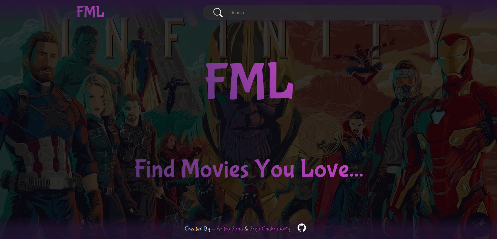

# FML 

Are you tired of endlessly scrolling through movie catalogs to find that perfect film for your evening's entertainment? Say goodbye to the frustration and hello to FML – the ultimate Movie Recommender System designed to help you "Find Movies you Love" effortlessly. FML, short for "Find Movies You Love," is your cinematic companion in the digital age. Whether you're a die-hard film buff or just looking for a cozy night in, FML is here to make your movie selection process a breeze.

## Preview 

## Hosted At 

[Checkout our website at Vercel by Clicking Here](https://fml-movies.vercel.app/)

- Server hosted at : 
- Client hosted at : 
- 

## Tech Stack 

**Client:**   

**Server:**   

**Machine Learning:**  

## License 

[MIT](./LICENSE.md)

## Creators 

- [Aritro Saha](https://github.com/halcyon-past) - Frontend and API creation

- [Srija Chakraborty](https://github.com/lily02092003) - Machine Learning Model for Recommendation and API

